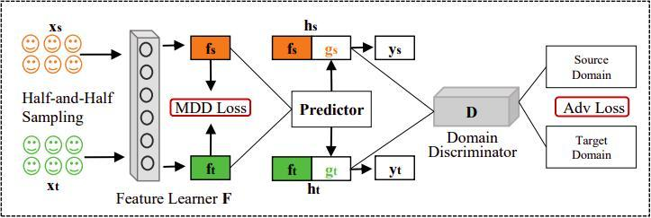

# Maximum Density Divergence for Domain Adaptation (MDD)

This is a simple pytorch-lightning reimplementation of the 'Maximum Density Divergence for Domain Adaptation' paper, which can be read [here](https://arxiv.org/pdf/2004.12615.pdf), while the code has been adapted from [here](https://github.com/lijin118/ATM). 

## Maximum Density Divergence

As stated in the paper abstract:
"*Unsupervised domain adaptation addresses the problem of transferring knowledge from a well-labeled source domain to an unlabeled target domain where the two domains have distinctive data distributions. Thus, the essence of domain adaptation is to mitigate the distribution divergence between the two domains. The state-of-the-art methods practice this very idea by either conducting adversarial training or minimizing a metric which defines the distribution gaps. In this paper, we propose a new domain adaptation method named Adversarial Tight Match (ATM) which enjoys the benefits of both adversarial training and metric learning. Specifically, at first, we propose a novel distance loss, named Maximum Density Divergence (MDD), to quantify the distribution divergence. MDD minimizes the inter-domain divergence and maximizes the intra-class density. Then, to address the equilibrium challenge issue in  adversarial domain adaptation, we consider leveraging the proposed MDD into adversarial domain adaptation framework*".  

The general framework is depicted in the following figure:



# Download datasets

Before training, one can automatically download [Office-31](https://people.eecs.berkeley.edu/~jhoffman/domainadapt/#datasets_code), [Image-clef](https://www.imageclef.org/2014/adaptation) and [Office-Home](https://www.hemanthdv.org/officeHomeDataset.html) datasets with the following commands:

* `python download_dataset.py --dataset image-clef`
* `python download_dataset.py --dataset office-31`
* `python download_dataset.py --dataset office-home`

Soon will be availble other datasets, such as MNIST, SVHN and so on.

# Requirements

This repo has been tested on a Linux machine (Ubuntu 18.04 LTS) with:
* python 3.8
* [Albumentations](https://albumentations.ai/)
* [PyTorch](https://pytorch.org/) 1.7
* [Pytorch-Lightning](https://pytorch-lightning.readthedocs.io/en/latest/) 1.1.3

To completely install the requirements run:

* `pip install -U -r requirements.txt`

# Command line arguments

To train a model one have to execute the `main.py` script, that can be run with the following command line arguments:

```
usage: main.py [-h] [--feature_ext {resnet18,resnet34,resnet50,resnet101,resnet152}] [--use_bottleneck]
               [--bottleneck_dim BOTTLENECK_DIM] [--new_classifier] [--random_proj] [--random_proj_dim RANDOM_PROJ_DIM] [--lr LR] [--momentum MOMENTUM] [--left_weight LEFT_WEIGHT] [--right_weight RIGHT_WEIGHT]
               [--cls_weight CLS_WEIGHT] [--mdd_weight MDD_WEIGHT] [--entropic_weight ENTROPIC_WEIGHT] [--loss_trade_off LOSS_TRADE_OFF] [--scheduler_lr SCHEDULER_LR] [--scheduler_weight-decay SCHEDULER_WEIGHT_DECAY]
               [--scheduler_gamma SCHEDULER_GAMMA] [--scheduler_power SCHEDULER_POWER] [--dset {office-31,image-clef,office-home}] [--source_domain SOURCE_DOMAIN] [--target_domain TARGET_DOMAIN] [--num_workers NUM_WORKERS]
               [--train_batch_size TRAIN_BATCH_SIZE] [--test_batch_size TEST_BATCH_SIZE] [--test_10crop]

model arguments:
  --feature_ext {resnet18,resnet34,resnet50,resnet101,resnet152}
                        feature extractor type
  --use_bottleneck      whether to use bottleneck in the classifier
  --bottleneck_dim BOTTLENECK_DIM
                        whether to use bottleneck in the classifier
  --new_classifier      whether to train a new classifier
  --random_proj         whether use random projection
  --random_proj_dim RANDOM_PROJ_DIM
                        random projection dimension
  --lr LR               learning rate
  --momentum MOMENTUM   momentum for the optimizer
  --left_weight LEFT_WEIGHT
  --right_weight RIGHT_WEIGHT
  --cls_weight CLS_WEIGHT
  --mdd_weight MDD_WEIGHT
  --entropic_weight ENTROPIC_WEIGHT
  --loss_trade_off LOSS_TRADE_OFF
  --scheduler_lr SCHEDULER_LR
                        learning rate for pretrained layers
  --scheduler_weight-decay SCHEDULER_WEIGHT_DECAY
                        weight decay for pretrained layers
  --scheduler_gamma SCHEDULER_GAMMA
                        gamma parameter for the inverse learning rate scheduler
  --scheduler_power SCHEDULER_POWER
                        power parameter for the inverse learning rate scheduler

data arguments:
  --dset {office-31,image-clef,office-home}
                        The dataset or source dataset type
  --source_domain SOURCE_DOMAIN
                        The source domain
  --target_domain TARGET_DOMAIN
                        The target domain
  --num_workers NUM_WORKERS
                        Pytorch DataLoader num workers
  --train_batch_size TRAIN_BATCH_SIZE
                        Training batch size
  --test_batch_size TEST_BATCH_SIZE
                        Testing batch size
  --test_10crop         Testing with random 10 crop
```  
Further `optional arguments` are the ones of the [Trainer](https://pytorch-lightning.readthedocs.io/en/latest/trainer.html#trainer-flags) class of [pytorch-lightning](https://pytorch-lightning.readthedocs.io/en/latest/). Run `python main.py --help` to completely view the command line arguments .  
By now, only the `office-31` and `image-clef` datasets are available, and one can train a model for example with:

* `python main.py --gpus "2,3" --feature_ext resnet50 --dset office-31 --source_domain amazon --target_domain webcam --max_steps 5000 --max_epochs 1 --default_root_dir ./chkpts --mdd_weight 0.01 --lr 0.001 --train_batch_size 32 --benchmark --new_classifier --use_bottleneck --val_check_interval 500 --accelerator ddp`
* `python main.py --gpus "2,3" --feature_ext resnet50 --dset image-clef --source_domain c --target_domain i --max_steps 5000 --max_epochs 1 --default_root_dir ./chkpts --mdd_weight 0.01 --lr 0.001 --train_batch_size 32 --benchmark --new_classifier --use_bottleneck --val_check_interval 500 --accelerator ddp`

During training one can inspect the model behaviour with, for example, [Tensorboard](https://pytorch-lightning.readthedocs.io/en/latest/logging.html) with the following command:

* `tensorboard --logdir ./chkpts/`

# Performances

We are trying to reproduce the reference paper performaces, we'll update here our best results. 

## Office-31

| Model     | A &rarr; W        | A &rarr; D        | D &rarr; W        | D &rarr; A        |
| --------- | ----------------- | ----------------- | ----------------- | ----------------- |
| Paper     | 95.7%             | 96.4%             | 99.3%             | 74.1%             |
| This repo | 95.3%<sup>1</sup> | 94.8%<sup>2</sup> | 98.6%<sup>3</sup> | 73.4%<sup>4</sup> |

Achieved with:

1. `python main.py --gpus "1,2" --feature_ext resnet50 --dset office-31 --source_domain amazon --target_domain webcam --max_steps 10000 --max_epochs 1 --default_root_dir ./chkpts --mdd_weight 0.01 --lr 0.01 --train_batch_size 32 --benchmark --accelerator ddp --test_10crop True --new_classifier --use_bottleneck`
2. `python main.py --gpus "1,2" --feature_ext resnet50 --dset office-31 --source_domain amazon --target_domain dslr --max_steps 15000 --max_epochs 1 --default_root_dir ./chkpts --mdd_weight 0.01 --lr 0.01 --train_batch_size 32 --benchmark --accelerator ddp --test_10crop True --new_classifier --use_bottleneck`
3. `python main.py --gpus "1,2" --feature_ext resnet50 --dset office-31 --source_domain dslr --target_domain webcam --max_steps 10000 --max_epochs 1 --default_root_dir ./chkpts --mdd_weight 0.01 --lr 0.01 --train_batch_size 32 --benchmark --accelerator ddp --test_10crop True --new_classifier --use_bottleneck`
4. `python main.py --gpus "1,2" --feature_ext resnet50 --dset office-31 --source_domain dslr --target_domain amazon --max_steps 10000 --max_epochs 1 --default_root_dir ./chkpts --mdd_weight 0.01 --lr 0.01 --train_batch_size 32 --benchmark --accelerator ddp --test_10crop True --new_classifier --use_bottleneck`

# Citations

Cite the paper as follows (copied-pasted it from arxiv for you):  

```
@article{Li_2020,
   title={Maximum Density Divergence for Domain Adaptation},
   ISSN={1939-3539},
   url={http://dx.doi.org/10.1109/TPAMI.2020.2991050},
   DOI={10.1109/tpami.2020.2991050},
   journal={IEEE Transactions on Pattern Analysis and Machine Intelligence},
   publisher={Institute of Electrical and Electronics Engineers (IEEE)},
   author={Li, Jingjing and Chen, Erpeng and Ding, Zhengming and Zhu, Lei and Lu, Ke and Shen, Heng Tao},
   year={2020},
   pages={1–1}
}
```

# License

This project is licensed under the MIT License

Copyright (c) 2021 Federico Belotti, Orobix Srl (www.orobix.com).

